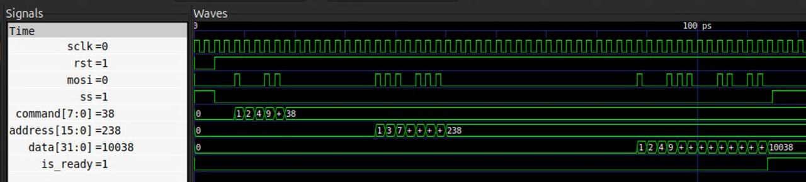

# ДЗ 2 по курсу "Системотехника", осень, 2025-2026 учебный год

Выполнил Карышев Борис Владимирович, группа ИУ4-11М.

## Условие

Нужно написать модуль - приемник данных, передаваемых по протоколу SPI.

Передаются:
- 1 байт - команда
- 2 байт - адрес
- 4 байт - данные

Необходимо выдать данные на выход параллельно.

## Решение

На выходе 3 регистра, которые заполняются последовательно.
Для соотв бита сдвигаем регистр, устанавливая текущий бит.

Данные передаются в порядке из условия: команда, адрес, данные.

Байты передаются по соглашению: MSB.

Ниже приведен скриншот выполнения кода в ПО gtkwave. На вход прдаются следующие значения:
- command = 38
- address = 238
- data = 10038

