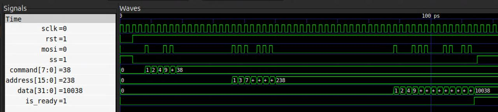

# ДЗ 3 по курсу "Системотехника", осень, 2025-2026 учебный год

Выполнил Карышев Борис Владимирович, группа ИУ4-11М.

## Условие

Нужно написать что-то вроде LRU Cache

На вход:
    каждый такт число X

На выход нужно отдать N поступивших на вход уникальных X в том же порядке, в котором они поступили.

## Решение

Для эффективного определения позиции поступившего числа сравниваем его со всеми сохраненными (куча AND) и дальше через энкодер определяем позицию (куча OR).

Если поступившее число найдено - сдвигаем все числа, поступившие раньше него.
Если не найдено, то сдвигаем все числа.

## Проверка корректности

Ниже приведен скриншот выполнения кода в ПО gtkwave. На вход прдаются следующие значения:

Так же мной были написаны автоматические тесты, валидирующие корректность разработанной программы на 1.000.000 случайных данных.

Код тестов лежит [тут](test_benches/main.cpp)
