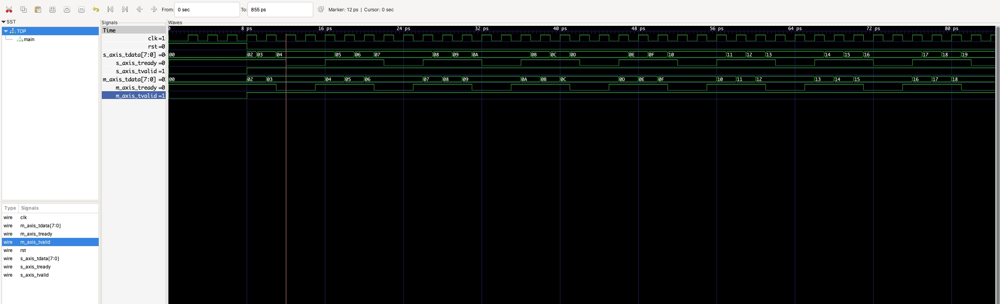

# ДЗ 1 по курсу "Системотехника", весна, 2025-2026 учебный год

**Данное ДЗ не выполнено, тут приведено только условие**

Выполнил Карышев Борис Владимирович, группа ИУ4-21М.

## Условие

AXI-stream

Последовательное соед модулей осуществляетсья по шине AXI-stream

4 канала:
- data ->
- valid ->
- last ->
- ready <-

Передача данных параллельная

Задаем данные в data
Когда готово выставляем valid в 1
Когда ready выставили в 1, данные считаются полученными

Задача - реализовать skid_buffer

В чем сложность - мгновенная передача каналов данных
ready должен поменяться на всех посл устройствах в один такт

Особенно трудно с ready

Поэтому придуман модуль axi_register или skid_buffer, который позволяет вставить регистр и в данные и в ready

## Решение

[Код решения](src/main.v)

## Проверка корректности

