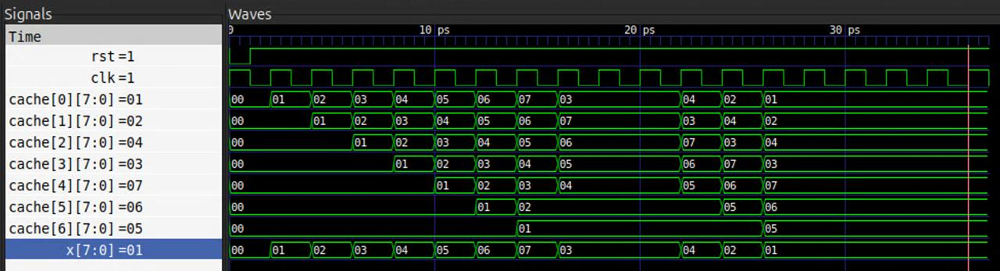

# ДЗ 2 по курсу "Системотехника", весна, 2025-2026 учебный год

**Данное ДЗ не выполнено, тут приведено только условие**

Выполнил Карышев Борис Владимирович, группа ИУ4-21М.

## Условие

Нужно написать дуалклоковую очередь для асинхронного перехода тоже на axi шине
Оно должно делать переходы между тактовыми доменами в устройстве (между модулями)

Основывается на предыдущей домашке

## Решение

## Проверка корректности

Код тестов лежит [тут](test_benches/main.cpp)
